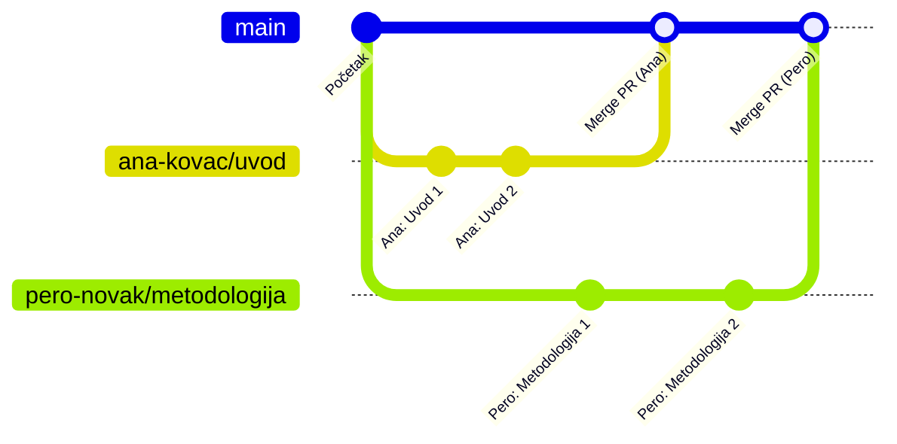

> ⏱️ **Procijenjeno vrijeme:** 15–20 minuta
> 📋 **Preduvjet:** Vault otvoren, Obsidian Git plugin konfiguriran (Poglavlje 3 i 4)

***

## 6.1 Što je branch i zašto ga koristimo?

### Analogija

Zamisli da radiš na važnom dokumentu i tvoj šef ti kaže:
*"Napravi kopiju ovog dokumenta, eksperimentiraj koliko hoćeš — original ostaje netaknut sve dok ne budemo zadovoljni tvojom verzijom."*

**Branch je točno to** — tvoja radna kopija cijelog repozitorija u kojoj možeš pisati, mijenjati i brisati što god hoćeš, a da ne utječeš na originalnu verziju ili na rad kolega.

Kada je tvoj rad gotov i pregledan, tek tada se spaja s originalnom verzijom.

### Zašto ne pisati direktno na `main`?

`main` je **glavna grana** — ona koja uvijek sadrži zadnju odobrenu, ispravnu verziju dokumentacije. Pravilo je jednostavno:

> **Na `main` granu nikad ne pišemo direktno — samo spajamo odobreni rad.**

Zašto? Jer ako više ljudi piše direktno na `main` istovremeno, dolazi do konflikata i nitko ne zna koja je verzija ispravna. Grane su rješenje tog problema.

***

## 6.2 Vizualni prikaz grananja

```text
main grana (stabilno)  =======[ Početni commit ]=======[ Merge Ana ]========[ Merge Pero ]=======>
                               \                        /              \                    /
ana-kovac/uvod                  +---[ Uvod 1 ]---[ Uvod 2 ]-+              \                  /
                                                                            +---[ Metodologija 1 ]-+
pero-novak/metodologija
```



  Svaka osoba radi u svom izoliranom prostoru (grani).
  Main grana se ažurira samo kada je rad pregledan, odobren i spojen (mergean).
```

### Životni ciklus jednog brancha

```text
1. Kreiraš branch      ->  "ana-kovac/uvod"
2. Pišeš i commitaš    ->  branch raste
3. Otvoriš PR          ->  kolega pregledava
4. Merge u main        ->  tvoj rad je dio glavne verzije
5. Branch se briše     ->  posao završen
```

***

## 6.3 Pravila imenovanja brancheva

Dobro ime brancha odmah govori **tko** radi **što**. Koristimo ovaj format:

```text
ime-prezime/naziv-zadatka
```

### Primjeri

| Dobro | Loše |
|---------|--------|
| `ana-kovac/uvod` | `moja-grana` |
| `pero-novak/metodologija` | `izmjene` |
| `mj-horvat/rezultati-q3` | `branch1` |
| `ana-kovac/ispravak-tablice` | `novo` |

### Pravila formata

- Samo **mala slova**
- Koristiti **crtice** umjesto razmaka ili podcrta
- **Bez naglašenih slova** (č, ć, š, ž, đ) — mogu uzrokovati probleme
- **Kratko i opisno** — maksimalno 3–4 riječi nakon kose crte

***

## 6.4 Kreiranje brancha u Obsidianu

Obsidian Git ne prikazuje gumbe za upravljanje granama u Source Control panelu — za to koristimo **Command Palette** (ikona `>_` na lijevoj traci ili prečac `Ctrl+P`), ugrađenu Obsidian funkcionalnost za pokretanje naredbi.

### Korak 1: Otvori Command Palette

Pritisni **`Ctrl + P`**

Otvara se traka za pretraživanje naredbi na vrhu ekrana.

### Korak 2: Kreiraj novi branch

1. Upiši: `git branch`
2. U rezultatima odaberi: **"Git: Create new branch"**
3. Pritisni **Enter**

### Korak 3: Upiši naziv brancha

Pojavljuje se polje za unos naziva:

```text
+-----------------------------------------+
|  Enter name of new branch               |
|  > ana-kovac/uvod                       |
+-----------------------------------------+
```

Upiši naziv prema pravilima iz poglavlja 6.3 i pritisni **Enter**.

✅ **Provjera uspjeha:** U statusnoj traci na dnu Obsidiana naziv brancha se promijenio:

```text
Prije na dnu ekrana:  ... prekriženi sync | ✓ | main
Nakon na dnu ekrana:  ... prekriženi sync | ✓ | ana-kovac/uvod
```

> 💡 **Savjet:** Uvijek provjeri statusnu traku prije nego počneš pisati — mora pisati tvoj branch, ne `main`. Pored naziva grane nalazi se i kvačica `✓` (Last commit status) te sinkronizacijski status.

***

## 6.5 Prebacivanje između postojećih brancheva

Ako trebaš privremeno pogledati tuđi branch ili se prebaciti na drugi vlastiti:

1. Pritisni **`Ctrl + P`**
2. Upiši: `switch` ili `Git: Switch branch`
3. Odaberi: **"Git: Switch branch"**
4. Iz popisa odaberi branch na koji se želiš prebaciti

> ⚠️ **Upozorenje:** Prije prebacivanja brancha uvijek napravi **commit** svih svojih promjena.
> 
> ℹ️ **Zašto vidiš iste promjene nakon prebacivanja grane?**
> Ako uneseš promjene u datoteku i prebaciš se na drugu granu **bez da napraviš commit**, Git će prenijeti te nekomitane (lokalne) promjene sa sobom na novu granu. To je standardno ponašanje Gita.
> Da bi promjene ostale zaključane na određenoj grani, **moraš napraviti Commit** prije prebacivanja! Tek nakon commita, promjene se "spremaju" na tu granu, a prebacivanjem na `main` vratit ćeš se na čistu verziju bez tih promjena.

***

## 6.6 Povratak na main

Kada završiš s radom na svom branchu i merge je obavljen (Poglavlje 3), možeš se vratiti na `main`:

1. **`Ctrl + P`** -> upiši `switch` -> odaberi **"Git: Switch branch"**
2. Iz popisa odaberi **`main`**
3. Odmah napravi **Pull** da preuzmeš zadnje odobrene promjene

***

## 6.7 Git CLI alternativa

Ako iz bilo kojeg razloga Command Palette ne funkcionira, iste operacije možeš napraviti kroz Command Prompt.

Otvori Command Prompt u folderu repozitorija:

> 💡 **Windows savjet:** Najlakše je otvoriti mapu projekta u Windows Exploreru, kliknuti na adresnu traku na vrhu (gdje piše putanja), upisati `cmd` i pritisnuti Enter. To će otvoriti Command Prompt izravno u tom folderu.

```cmd
cd %USERPROFILE%\Desktop\EU-Project-Template
```

### Kreiranje i prebacivanje na novi branch

```cmd
git checkout -b ana-kovac/uvod
```

> ℹ️ Zastavica `-b` znači "kreiraj novi branch i odmah se prebaci na njega" — sve u jednoj naredbi.

### Pregled svih brancheva

```cmd
git branch
```

Rezultat:
```cmd
  main
* ana-kovac/uvod       <- zvjezdica označava na kojem si trenutno
  pero-novak/metodologija
```

### Prebacivanje na postojeći branch

```cmd
git checkout main
```

### Slanje novog brancha na GitHub

Kada prvi put pushaš novi branch na GitHub, treba mu reći gdje:

```cmd
git push -u origin ana-kovac/uvod
```

> ℹ️ Zastavica `-u origin` potrebna je samo **prvi put** za novi branch. Sve sljedeće pusheve s tog brancha radiš jednostavno s `git push`.

Nakon prvog pusha, Obsidian Git plugin prepoznaje branch i možeš nastaviti koristiti gumbe u sučelju kao i obično.

> ⚠️ **Rješavanje greške 403 (Permission denied) pri pushanju:**
> Ako dobiješ grešku poput:
> `remote: Permission to FGAG-docs/EU-Project-Template.git denied to sime.`
> `fatal: unable to access 'https://github.com/FGAG-docs/EU-Project-Template/': The requested URL returned error: 403`
> To znači da tvoj GitHub račun nema pravo pisanja u taj repozitorij. Provjeri:
> 1. Jesi li prihvatio/la pozivnicu za projekt na svom e-mailu? Ako je nema, traži od administratora da ti ponovno pošalje pozivnicu.
> 2. Prijavljuješ li se s ispravnim GitHub računom koji je dodan na projekt?

***

## 6.8 Pregled: naredbe na jednom mjestu

| Radnja | Obsidian (Ctrl+P) / Klik | Git CLI |
|--------|------------------|---------|
| Kreiraj novi branch | `Git: Create new branch` | `git checkout -b ime/naziv` |
| Prebaci se na branch | `Git: Switch branch` (ili klik na branch u statusnoj traci!) | `git checkout ime-brancha` |
| Pregled svih brancheva | Klik na branch u statusnoj traci | `git branch` |
| Provjeri trenutni branch | Statusna traka (dno ekrana) | `git branch` (zvjezdica) |
| Pošalji branch na GitHub | Push gumb (Source Control) | `git push -u origin ime-brancha` |

***

## ✅ Što smo naučili u ovom poglavlju

| Koncept | Objašnjenje |
|---------|-------------|
| **Branch** | Izolirana radna kopija repozitorija za jednog autora |
| **main** | Glavna grana — uvijek stabilna, nikad se ne piše direktno |
| **Imenovanje** | Format `ime-prezime/naziv-zadatka`, bez naglašenih slova |
| **Command Palette** | `Ctrl+P` — centralno mjesto za sve Git operacije u Obsidianu |
| **Statusna traka** | Uvijek provjeri naziv brancha prije pisanja |
| **Prvi push** | Novi branch treba `git push -u origin naziv` prvi put |

> **Zlatno pravilo brancheva:** Jedan zadatak = jedan branch. Kada je zadatak gotov i mergean, branch se briše i kreiraš novi za sljedeći zadatak. Ne nakupljaj stare brancheve — postaje zbunjujuće.

***


